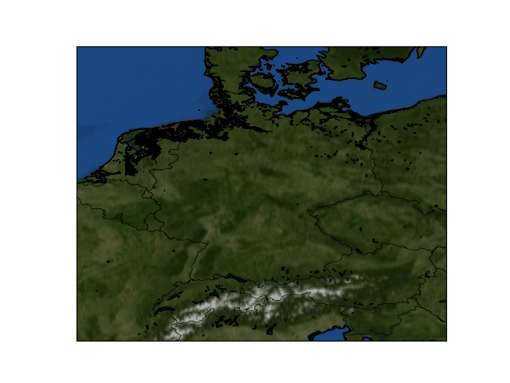

# sea-level-rise-sim

This repo produces a simulation (a gif) visualizing which areas will get drowned as sea-level rises. Currently, a DEM (Digital Elevation Model) is required as an input. In the future, I am planning to automate the DEM download, just by giving the bounds (top-left, and bottom-right corner) or the country name.

#### Here is an example for India and Sri Lanka

#### Here is an example for Germany

#### Installation
I recommend not to run `pip install requirements` as we want to install the requirements in specific order.  Run `cat requirements.txt | xargs -n 1 -L 1 pip install` instead.

#### Caution
Note that this is a compute intensive process and a lot of temporary files are generated.   In future, I plan to refactor the code so as to reduce the compute required.

#### TODO
- Add texts in the gif - sea-level chaged; area drowned, etc.
- Add other basemaps (besides RGB) like terrain, releif, etc. and make a gif with these as sub-plots
- Alternative background methods like `arcgisimage` for higher resolution basemap
- Remove boundary from the polygons that represent drowned areas
- Automate data download process
- Add functionality to produce gif just based on country name as input
